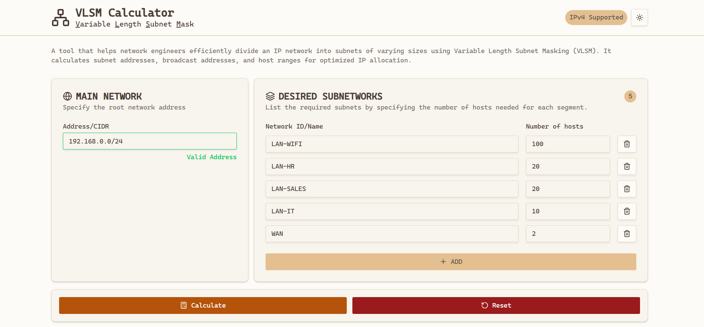
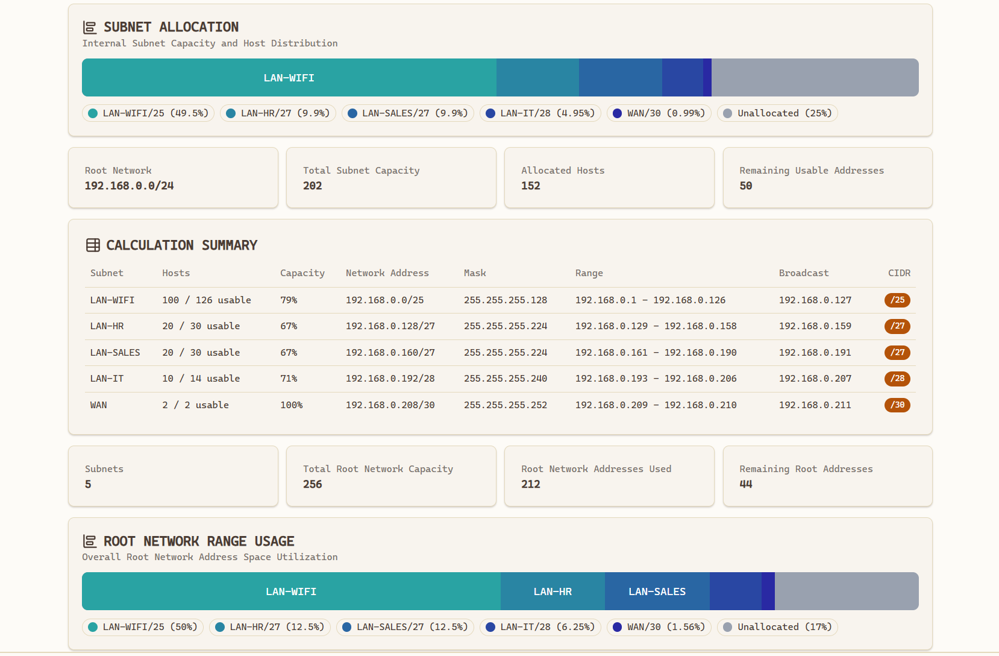

# 🧮 VLSM Subnet Calculator

<div align="center">

[](https://nextjs.org/)
[](https://reactjs.org/)
[](https://www.typescriptlang.org/)
[](https://tailwindcss.com/)
[](https://ui.shadcn.com/)
[](https://www.docker.com/)
[](https://bun.sh/)
[](https://github.com/features/actions)

</div>

A modern, intuitive, and responsive VLSM (Variable Length Subnet Masking) calculator, designed to help network administrators, students, and IT enthusiasts efficiently plan and allocate IP address space.

---

### ✨ [Live Demo Link](https://vlsm.xako.net) 👈

---




## 🚀 About The Project

This project goes beyond a simple calculation tool. It has been designed as a comprehensive web application, implementing front-end development and DevOps best practices. The goal was to create a fluid, error-free user experience and ensure the project is easy to run and deploy thanks to containerization.

The architecture clearly separates the calculation logic (VLSM engine), global state management, and user interface components, making the code maintainable and scalable.

## 🎯 Features

- **Comprehensive VLSM Calculation**: Allocates subnets based on size requirements, from largest to smallest.
- **Real-time Validation**: Validates the root network address and requested subnet sizes before calculation to prevent errors.
- **Detailed Summary**: For each subnet, displays the Network ID, Subnet Mask (in CIDR and decimal), Usable Host Range, and Broadcast Address.
- **Allocation Visualization**: A progress bar shows how the total address space is allocated.
- **Containerized with Docker**: Ready to be deployed or run locally in a containerized environment.
- **Dark/Light Theme**: Switch between themes for optimal visual comfort.
- **Responsive Design**: Usable on desktop, tablet, and mobile.

## 🛠️ Tech Stack

This project was built with modern and powerful technologies:

- **Containerization**: [Docker](https://www.docker.com/) & [Docker Compose](https://docs.docker.com/compose/)
- **Framework**: [Next.js](https://nextjs.org/) (React App Router)
- **Language**: [TypeScript](https://www.typescriptlang.org/)
- **Styling**: [Tailwind CSS](https://tailwindcss.com/)
- **UI Components**: [Shadcn/ui](https://ui.shadcn.com/)
- **State Management**: [React Context API](https://react.dev/learn/passing-data-deeply-with-context)
- **Runtime/Bundler**: [Bun](https://bun.sh/)

## 🌐 Deployment & CI/CD

This project features a robust and automated deployment pipeline, showcasing end-to-end DevOps practices:

- **Continuous Integration with GitHub Actions**: Every push to the `main` branch triggers a CI workflow that builds and tests the application.
- **Dockerized Deployment**: Upon successful CI, a Docker image of the application is built and published to the GitHub Container Registry (**`ghcr.io`**).
- **Automated Updates with Watchtower**: On the production server (`vlsm.xako.net`), Watchtower monitors this registry. When a new image is detected, it automatically pulls the update and restarts the application container, ensuring zero-downtime continuous deployment.
- **Cloudflare Proxy & Security**: The application is proxied through Cloudflare, benefiting from its CDN for performance, DDoS protection, and edge TLS termination.
- **Nginx Local TLS Termination**: On the server, Nginx acts as a reverse proxy, handling local TLS termination for `vlsm.xako.net` and other subdomains, further securing and routing traffic efficiently.

This setup ensures rapid, reliable, and secure delivery of updates from development to production.

## 🐳 Quick Start with Docker

The easiest and recommended way to get the application running is with Docker. The pre-built image is available at **`ghcr.io/ilyas-bouktrane/vlsm-calculator:latest`**.

1.  **Prerequisites**: Make sure you have [Docker](https://www.docker.com/products/docker-desktop/) installed on your machine.

2.  **Option A: Quick Run (single command)**
    If you just want to quickly try the application using the pre-built image:

    ```sh
    docker run -d -p 3000:3000 --name vlsm-calculator ghcr.io/ilyas-bouktrane/vlsm-calculator:latest
    ```

    Then, open your browser and visit `http://localhost:3000`. To stop and remove the container:

    ```sh
    docker rm -f vlsm-calculator
    ```

3.  **Option B: With Docker Compose (for development/management)**
    For more comprehensive management or if you want to build the image locally:

    a. **Clone the repository**

    ```sh
    git clone https://github.com/ilyas-bouktrane/vlsm-calculator.git
    cd vlsm-calculator
    ```

    b. **Launch with Docker Compose**

    ```sh
    docker compose up -d
    ```

    This command will build the Docker image (if not already present) and start the container in production mode in the background.

    c. **Open your browser**
    Visit `http://localhost:3000` to see the application running. To stop: `docker compose down`.

## ⚙️ Local Development (Without Docker)

If you prefer to run the project without Docker for development purposes:

1.  **Clone the repository**

    ```sh
    git clone https://github.com/ilyas-bouktrane/vlsm-calculator.git
    cd vlsm-calculator
    ```

2.  **Install dependencies**
    Make sure you have [Bun](https://bun.sh/docs/installation) installed. Then, run:

    ```sh
    bun install
    ```

3.  **Start the development server**

    ```sh
    bun run dev
    ```

4.  **Open your browser**
    Visit `http://localhost:3000` to see the application.

## 📂 Project Structure

The project is organized with a clear separation of concerns, making it modular and easy to navigate.

```
/
├── 📁 app/         # Contains the pages for the Next.js App Router, defining the UI layout and entry point.
│
├── 📁 components/  # Home for all reusable React components.
│   ├── 📁 theme/   # Holds components responsible for the dark/light mode functionality.
│   ├── 📁 ui/      # Contains base UI components from Shadcn/ui (Button, Card, etc.).
│   └── 📁 vlsm/    # Contains high-level components specific to the VLSM calculator's features.
│
├── 📁 lib/        # Central hub for the application's core logic, type definitions, and shared utilities.
│
├── 📁 public/     # Stores all static assets like icons and images that are publicly accessible.
│
└── 📁 .github/    # Contains GitHub Actions workflow files for CI/CD and automated deployments.
```

## 👨‍💻 Contact

This project was created by **Ilyas Bouktrane**.

[](https://linkedin.com/in/ilyas-bouktrane)
[](https://github.com/ilyas-bouktrane)

Feel free to contact me with any questions or opportunities!
